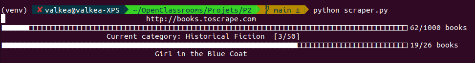
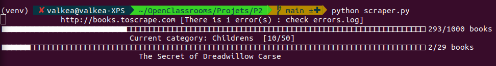
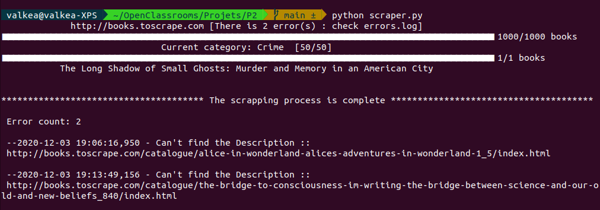

# BookScraper

BookScraper is a Python script created for scraping the content of the http://books.toscrape.com

## Installation

In order to use this script, you need to follow the steps below:

### First, 
let's duplicate the project github repository

```bash
>>> git clone https://github.com/Valkea/OC_P1.git
>>> cd OC_P1
```

### Secondly,
let's create a virtual environment and install the required Python libraries

```bash
>>> python3 -m venv venv
>>> source venv/bin/activate
>>> pip install -r requirements.txt
```

### Finally,
we can start scraping the website by using the following command

```bash
>>> python3 scraper.py
```
The following progress bar will appears in the Terminal so you can know the progress.


If for any reason the script encounter some FileIO errors, it will be indicated next to the website address.


Once completed, you will get a mini report and the top 5 errors messages from the errors.log (if any).


You can also use the '-s' or '--slide' parameter to test some specific parts of the project.

```bash
>>> python3 scraper.py --slide 1
'This runs the product page scraping only'
'You can check the generated files in demo/slide1'
```
```bash
>>> python3 scraper.py --slide 2
'This runs the category page scraping (and hence the product pages)'
'You can check the generated files in demo/slide2'
```
```bash
>>> python3 scraper.py --slide 3
'You can check the generated files in demo/slide3'
```

## Tests
You can test the modules of the script with pytest.

```bash
>>> pytest -s 
```
Be careful, the whole test is pretty long !
So instead, you can test one class at a time with the following commands.

```bash
>>> pytest -sk TestBook
>>> pytest -sk TestCategory
>>> pytest -sk TestScraper
>>> pytest -sk TestFileIO
```

## Ouputs

### Errors
you can find any scraping errors in the errors.log file along with the page URL.

### Data
you can find the scraped information and images in the 'data' folder. Each category is provided with its own 'category_folder' in which you will be able to find the downloaded images and the generated csv file.

### Demo data
when running the script in slide mode, the generated data are stored into a 'demo' folder.


## License
[MIT](https://choosealicense.com/licenses/mit/)
